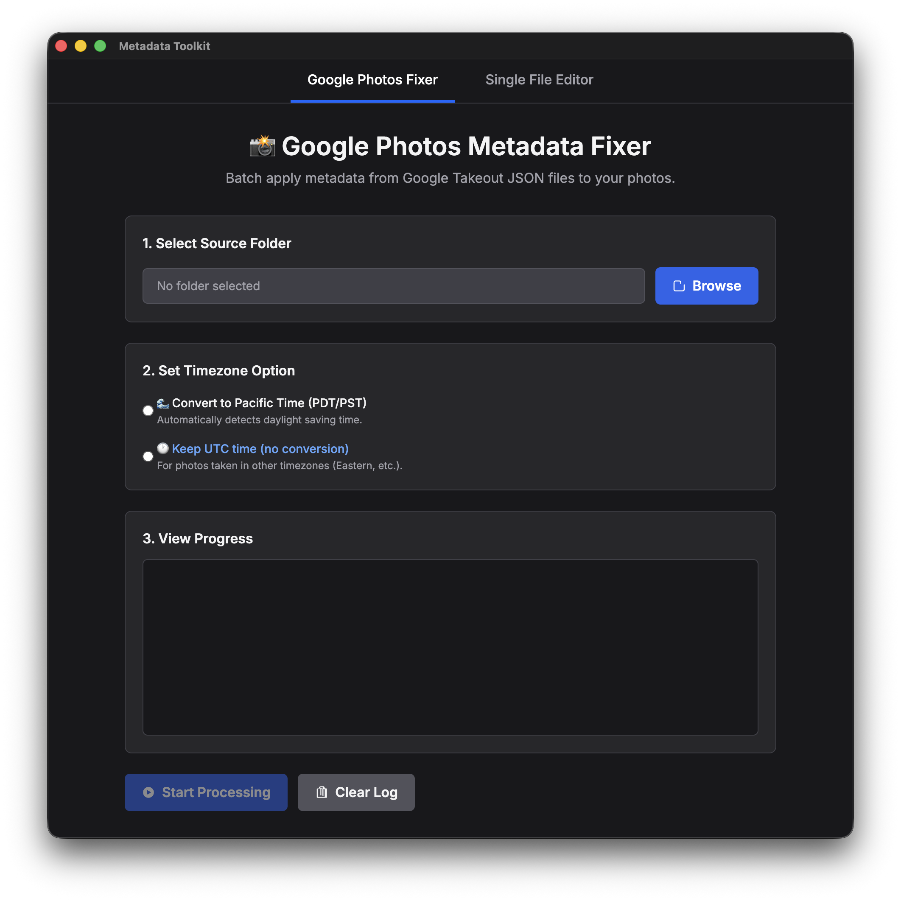
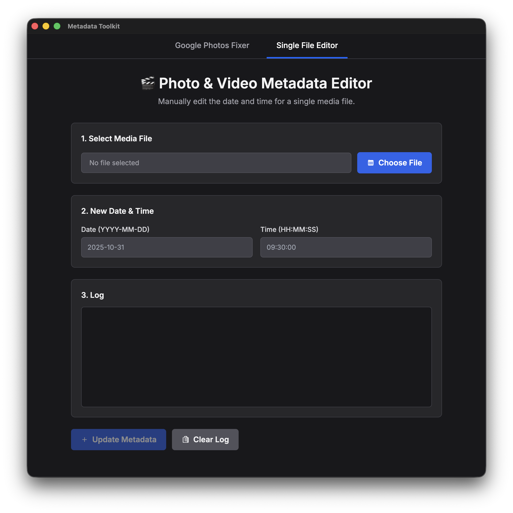

# **Metadata Toolkit**

A user-friendly desktop app that combines two powerful tools into one: a **Google Photos Fixer** for batch-processing Google Takeout folders, and a **Single File Editor** for manually correcting individual media files.  

## Features
This toolkit provides two distinct modes, accessible from the main navigation bar:

### Google Photos Fixer (Batch Tool)

Restore correct dates, times, GPS tags, and descriptions to your Google Photos exports by reading their Takeout JSON sidecars.

* **Batch Processing:** Fix your entire library's "taken time" at scale.  
* **Timezone Options:** Convert timestamps to Pacific Time (handles DST) or keep them in UTC.  
* **Full Metadata:** Writes GPS coordinates and Google Photos descriptions to embedded metadata.  
* **File Organization:**  
  * Moves media without matching JSONs to a NO\_METADATA\_FOUND folder.  
  * Collects all used JSONs into a JSON\_METADATA folder after processing.

### Single File Editor (Manual Tool)

Manually edit the date and time metadata of a single photo or video file.

* **File Picker:** Select any supported media file (.jpg, .jpeg, .heic, .png, .mp4, .mov, etc.).  
* **Date & Time Inputs:** Easily set a new, precise date (YYYY-MM-DD) and time (HH:MM:SS).  
* **Comprehensive Update:** Writes the new timestamp to *all* relevant date/time tags inside the file (including AllDates, FileCreateDate, TrackCreateDate, etc.).

## Requirements
- Python 3 installed on your system (macOS or Windows).  
  - macOS: Verify it is installed with `python3 --version`. If needed, install from python.org.  
  - Windows: Install from python.org and ensure “Add Python to PATH” is checked during setup.  
- ExifTool is bundled with the app—no separate installation required for end users.  

## **How to Use**

1. **Download:** Grab the .dmg (macOS) or .exe (Windows) installer from the [Releases Page](https://github.com/maybetoasty/Multi-Purpose-Metadata-Editor/releases).  
2. **Install:**  
   * **macOS:** Open the .dmg and drag the **Metadata Toolkit** app to your "Applications" folder.  
   * **Windows:** Run the .exe installer.  
3. **Launch:** Open the **Metadata Toolkit** app.  
4. **Select a Tool:** Use the navigation bar at the top to choose either **Google Photos Fixer** or **Single File Editor**.

### **If using the Google Photos Fixer:**

1. **Select Folder:** Click **Browse** and choose your main Google Photos Takeout folder (e.g., Takeout/Google Photos).  
2. **Set Timezone:** Choose **Convert to Pacific Time** or **Keep UTC time**.  
3. **Start Processing:** Click **▶ Start Processing** and confirm by clicking **Yes**.  
4. **Monitor:** Watch the **View Progress** log for updates (✓), warnings (⚠️), and errors (✗). You can use the **Pause** button to temporarily stop the batch process on macOS/Linux.  
5. **Completion:** When "Processing Complete\!" appears, your media files are updated. Unmatched files will be in the NO\_METADATA\_FOUND folder, and all used JSONs will be in the JSON\_METADATA folder.

### **If using the Single File Editor:**

1. **Select File:** Click **Choose File** and select the single photo or video you want to modify.  
2. **New Date & Time:** The app will fill in the current date and time. Change the **Date (YYYY-MM-DD)** and **Time (HH:MM:SS)** to the new values you want.  
3. **Update:** Click the **Update Metadata** button and confirm by clicking **Yes**.  
4. **Check Log:** A "✅ Metadata Updated Successfully\!" message will appear in the log on success.

